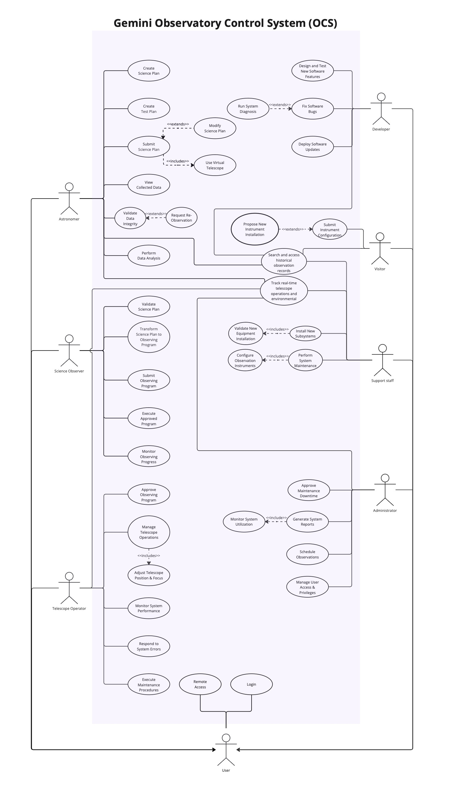

# Gemini5\_D2\_Usecase.md
## Usecase Diagram

## Astronomer

| usecase | short description |
| :---- | :---- |
| Create Science Plan | The astronomer creates a science plan specifying observation targets, conditions, and instrument configurations. |
| Create Test Plan | The astronomer prepares a test plan to validate telescope performance and data integrity. |
| Submit Science Plan | The astronomer submits the science plan for validation and scheduling. |
| Modify Science Plan | The astronomer updates the science plan to refine observations or adjust configurations. |
| Use Virtual Telescope | The astronomer utilizes a virtual telescope to simulate observations and verify configurations. |
| View Collected Data | The astronomer accesses and reviews the data collected from observations. |
| Validate Data Integrity | The astronomer ensures the collected data is accurate and free of errors.  |
| Request Re-Observation | The astronomer submits a request for re-observation if data is incomplete or faulty. |
| Perform Data Analysis | The astronomer analyzes the collected data to extract scientific insights. |

## 

## Science Observer

| usecase | short description |
| :---- | :---- |
| Validate Science Plan | The science observer verifies the submitted science plan for feasibility and accuracy. |
| Transform Science Plan to Observing Program | The science observer converts an approved science plan into an executable observing program. |
| Submit Observing Program | The science observer submits the finalized observing program for execution. |
| Execute Approved Program | The science observer runs the approved observation plan. |
| Monitor Observing Progress | The science observer supervises the execution of the observation program. |

## 

## Telescope Operator

| usecase | short description |
| :---- | :---- |
| Approve Observing Program | The telescope operator gives final approval for observation programs. |
| Manage Telescope Operations | The telescope operator oversees telescope activities and ensures smooth operations. |
| Adjust Telescope Position & Focus | The telescope operator fine-tunes the telescope’s alignment and focus. |
| Monitor System Performance | The telescope operator checks the telescope’s performance and system status. |
| Respond to System Errors | The telescope operator resolves system malfunctions and errors. |
| Execute Maintenance Procedures | The telescope operator performs maintenance tasks to keep the telescope operational. |

## Developer

| usecase | short description |
| :---- | :---- |
| Design and Test New Software Features | The developer creates and tests software features. |
| Fix Software Bugs | The developer resolves identified software issues. |
| Run System Diagnosis | The developer runs system diagnostics to detect issues. |
| Deploy Software Updates | The developer applies software updates to enhance functionality. |

## Visitor

| usecase | short description |
| :---- | :---- |
| Submit Instrument Configuration | The visitor provides configuration details for observation instruments to be reviewed and implemented. |
| Propose New Instrument Installation | The visitor submits a proposal for a new instrument, including its purpose, specifications, and requirements for validation. |

## Support staff

| usecase | short description |
| :---- | :---- |
| Install New Subsystems | The support staff sets up new subsystems. |
| Validate New Equipment Installation | The support staff verifies the proper installation of new equipment. |
| Perform System Maintenance | The support staff conducts maintenance to ensure system reliability. |
| Configure Observation Instruments | The support staff adjusts observation equipment for optimal performance. |

## Adminstrator

| usecase | short description |
| :---- | :---- |
| Monitor System Utilization | The administrator monitors the system to ensure the system operates efficiently and to detect potential issues. |
| Approve Maintenance Downtime | The administrator approves scheduled or unscheduled system downtimes required for maintenance tasks. |
| Generate System Reports | The administrator generates detailed reports containing information on the system. This use case includes monitoring system utilization as part of the process. |
| Schedule Observations | The administrator schedules specific periods or activities to observe the system. |
| Manage User Access & Privileges | The administrator assigns or modifies access and privileges for system users. |

## Mutual activity

| usecase | short description |
| :---- | :---- |
| Search and access historical observation records | The developer, visitor, astronomer, and support staff can search and access reference past observations to enhance current research, validate scientific findings, or troubleshoot telescope performance. |
| Track real-time telescope operations and environmental conditions. | The astronomer, telescope operator, support staff, and administrator can monitor and analyze live data from the telescope and its surrounding real-time. |
| Remote Access | The user connects to the system remotely. |
| Login | The user signs into the system to perform their tasks. |

## Group Members

| ID | Name |
| :---- | :---- |
| 6588051 | Benjaphol Kositanon |
| 6588075 | Sorawit Piriyapanyaporn |
| 6588152 | Jinnipa Leepong |
| 6588164 | Thonthan Arunyawas |
| 6588178 | Nichakul Kongnual |
| 6588187 | Punyaporn Putthajaksri |

